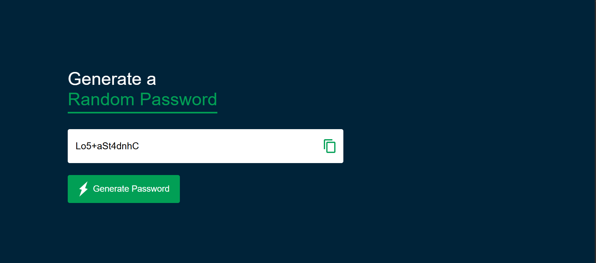

# 🔐 Random Password Generator

A simple, responsive, and user-friendly **Random Password Generator** built using **HTML, CSS, and JavaScript**.

The application generates a strong random password containing **uppercase letters, lowercase letters, numbers, and special characters**. Users can also copy the generated password to the clipboard with a single click.

---

## 🚀 Live Demo

https://nileshpadalwar.github.io/RandomPassword-Generator/

---


## 📸 Project Preview



---

## ✨ Features

* 🔐 Generate random passwords instantly
* 🔤 Includes uppercase letters
* 🔡 Includes lowercase letters
* 🔢 Includes numbers
* 🔣 Includes special characters
* 📋 Copy generated password to clipboard
* 🎨 Clean and modern user interface
* 📱 Responsive design
* ⚡ Lightweight and fast
* 🧩 Built using vanilla JavaScript without external frameworks

---

## 🛠️ Technologies Used

| Technology | Purpose                                         |
| ---------- | ----------------------------------------------- |
| HTML5      | Application structure                           |
| CSS3       | Styling and responsive design                   |
| JavaScript | Password generation and clipboard functionality |

---

## 📂 Project Structure

```text
RandomPassword_Generator/
│
├── index.html
├── style.css
├── script.js
│
├── images/
│   ├── copy.png
│   └── generate.png
│
└── README.md
```

---

## ⚙️ How It Works

The password generator creates a random password using four different character groups:

```javascript
const upperCase = "ABCDEFGHIJKLMNOPQRSTUVWXYZ";
const lowerCase = "abcdefghijklmnopqrstuvwxyz";
const number = "0123456789";
const symbol = "@#$%^&*()_+~|}{[]></-=";
```

These character sets are combined into one collection:

```javascript
const allChars = upperCase + lowerCase + number + symbol;
```

The application guarantees that the generated password contains at least:

* One uppercase letter
* One lowercase letter
* One number
* One special character

The remaining characters are randomly selected until the password reaches the required length.

---

## 🔑 Password Length

The default password length is:

```javascript
const length = 12;
```

Therefore, each generated password contains **12 characters**.

You can change the password length by modifying this value:

```javascript
const length = 16;
```

---

## 📋 Copy Password

The application provides a copy button that allows users to copy the generated password.

```javascript
function copyPassword(){
    passwordBox.select();
    document.execCommand("copy");
    alert("Password copied to clipboard!");
}
```

---

## ▶️ How to Run the Project

### 1. Clone the repository

```bash
git clone https://github.com/NileshPadalwar/RandomPassword-Generator.git

### 2. Navigate to the project

```bash
cd RandomPassword_Generator
```

### 3. Open the project

Open `index.html` in your browser.

You can also use **Visual Studio Code with the Live Server extension** for development.

---

## 💡 Usage

1. Open the application.
2. Click **Generate Password**.
3. A random 12-character password will be generated.
4. Click the **Copy** icon to copy the password.
5. Use the password wherever required.

---

## 🔮 Future Improvements

The project can be enhanced with additional features such as:

* [ ] Custom password length
* [ ] Include/exclude uppercase letters
* [ ] Include/exclude lowercase letters
* [ ] Include/exclude numbers
* [ ] Include/exclude special characters
* [ ] Password strength indicator
* [ ] Copy notification instead of browser alert
* [ ] Dark/Light mode
* [ ] Password history
* [ ] Improved mobile responsiveness

---

## 🎯 Learning Outcomes

Through this project, I practiced:

* DOM manipulation using JavaScript
* JavaScript functions
* Random number generation
* String manipulation
* Event handling
* Clipboard functionality
* HTML form/input handling
* CSS Flexbox
* Responsive UI design

---

## 👨‍💻 Author

**Nilesh Padalwar**

Frontend / Angular Developer

### Connect With Me

* 💼 LinkedIn: Add your LinkedIn profile
* 🐙 GitHub: Add your GitHub profile
* 📧 Email: Add your email address

---

## ⭐ Support

If you found this project useful or interesting, please consider giving the repository a ⭐ on GitHub.

---

## 📄 License

This project is created for learning and portfolio purposes.
